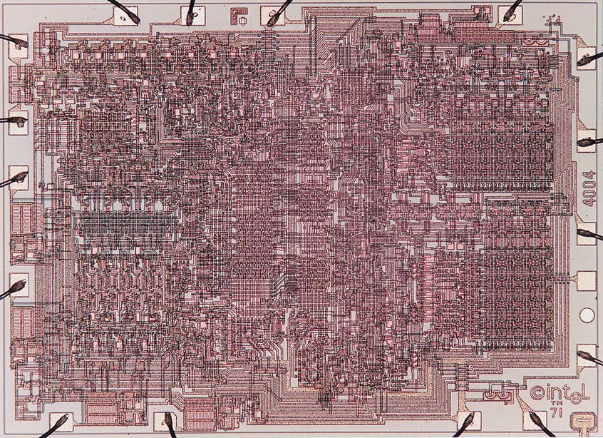
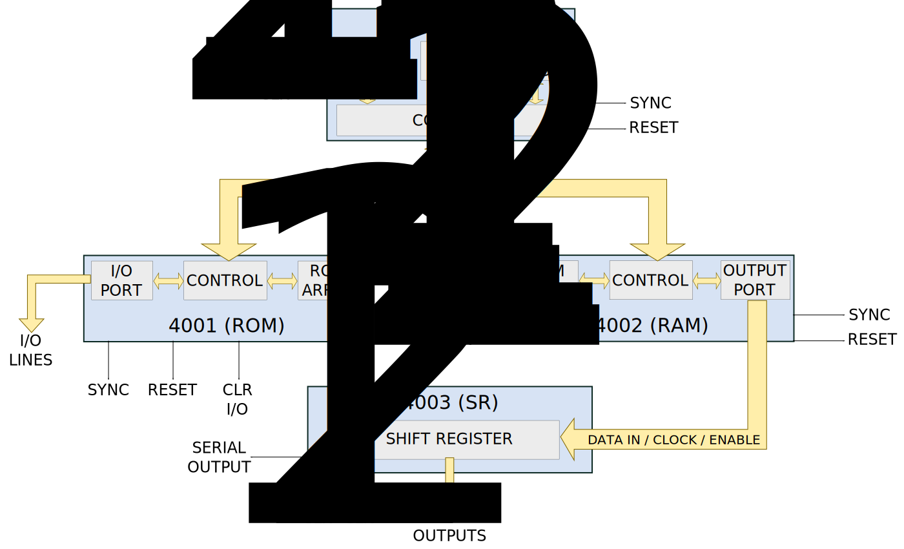

# Intel 4004 Microprocessor Recreation

*A cycle-accurate recreation of Federico Faggin's pioneering 4004 microprocessor in open-source silicon, alongside modern evolutionary architectures.*

[](https://opensource.org/licenses/Apache-2.0)
[](https://github.com/The-OpenROAD-Project/OpenLane)
[](https://github.com/google/skywater-pdk)
[](https://4004.hashnode.dev)


*Real die shot of the historic Intel 4004, the world's first microprocessor*

## 🎯 Project Goals

This project recreates the complete Intel MCS-4 system while simultaneously exploring the "what ifs" of computer architecture history. The goals are:

1. **Historical Preservation**: Document and preserve the 4004's architecture for future generations
2. **Evolutionary Exploration**: Design pipelined and RISC variants to demonstrate architectural progression
3. **Education**: Provide a working, understandable example of early microprocessor design
4. **Physical Silicon**: Manufacture actual working chips through Efabless/SkyWater

## 📖 The Story

The Intel 4004, designed by Federico Faggin in 1971, was the world's first single-chip microprocessor. It contained 2,300 transistors and enabled the microcomputer revolution.

This recreation honors Faggin's pioneering work by bringing his design into the modern era of open-source silicon. I am traveling to Italy to visit Olivetti (where Faggin started his career), his hometown of Vicenza, and to study the history that led to this revolutionary chip.

**[Read the full journey →](docs/historical/italy-trip.md)**

**[Follow the development blog →](https://4004.hashnode.dev)**

## 🏗️ Classic Architecture (MCS-4 System)

The core foundation of this project is the faithful recreation of the original chipset:

- **[4004 CPU](docs/architecture/4004-architecture.md)**: 4-bit processor, 46 instructions, cycle-accurate serial arithmetic
- **[4001 ROM](docs/architecture/4001-rom.md)**: 256 bytes per chip
- **[4002 RAM](docs/architecture/4002-ram.md)**: 40 bytes per chip
- **[4003 Shift Register](docs/architecture/4003-shift.md)**: 10-bit I/O expansion

**[See architecture documentation →](docs/architecture/)**



## 🧪 Experimental Cores

Beyond the faithful recreation, this project includes two novel cores that explore alternative histories and modern design principles:

### Core B: Pipelined 4004 ("The What-If")
A high-performance reimagining of the 4004. It asks the question: *If the 1971 engineers had a larger transistor budget, how fast could they have made this chip?*
- **Architecture**: 5-Stage Pipeline (Fetch, Decode, Execute, Memory, Writeback)
- **Datapath**: Full 4-bit parallel execution (replacing the original serial ALU)
- **Compatibility**: 100% binary compatible with the original 4004 ISA and bus
- **Performance**: Targets significantly higher IPC (Instructions Per Cycle)

### Core C: RISC-4
A clean-slate, novel 4-bit architecture designed for modern efficiency and compiler friendliness.
- **Architecture**: 5-Stage Pipeline with Von Neumann memory model
- **ISA**: Custom fixed-width RISC (Load/Store architecture)
- **Features**: Simplified control logic, unified memory bus, and modern hazard handling
- **Specification**: **[View the RISC-4 ISA Repo →](https://github.com/jking323/risc-4)**

## 🚀 Current Status

- [x] Research and historical study
- [x] Development environment setup
- [x] Blog and documentation framework
- [ ] RTL design: Faithful 4004 (in progress)
- [ ] RTL design: Pipelined 4004
- [ ] RTL design: RISC-4
- [ ] Verification & Co-simulation
- [ ] OpenLane hardening
- [ ] Tape-out submission
- [ ] Silicon fabrication

**[More Detailed Milestone List for 4004](docs/timeline/4004-milestones.md)**

**[More Detailed Milestone List for Pipelined 4004](docs/timeline/4004-pipeline.md)**

**[More Detailed Milestone List for RISC-4 Core](docs/timeline/risc-4-milestones.md)**

**[Track progress on the blog →](https://4004.hashnode.dev)**

**[See design journal →](docs/design-journal/)**

## 🛠️ Quick Start

### Prerequisites
```bash
# Install Verilog simulator and waveform viewer
brew install icarus-verilog gtkwave

# Install Python testbench framework
pip3 install cocotb pytest

```

### Running Simulations

```bash
# Run basic CPU tests
cd sim
make test_cpu

# Run full system test
make test_system

# View waveforms
gtkwave waveforms/cpu_test.vcd

```

**[Full setup guide →](https://www.google.com/search?q=docs/README.md)**

## 📚 Documentation

* **[Development Blog](https://4004.hashnode.dev)**: Weekly updates, design decisions, and journey
* **[Architecture](https://www.google.com/search?q=docs/architecture/)**: Design documentation and block diagrams
* **[Historical Context](https://www.google.com/search?q=docs/historical/)**: The 4004's history and my research journey
* **[Design Journal](https://www.google.com/search?q=docs/design-journal/)**: Detailed progress updates
* **[Verification](https://www.google.com/search?q=docs/verification/)**: Test plans and results
* **[Datasheets](https://www.google.com/search?q=docs/datasheets/)**: Original Intel documentation

## 🎨 Silicon Artwork

Following the tradition of chip designers, this design includes artwork etched in the metal layers:

* Tribute to Federico Faggin
* Historical timeline (1971 → 2026)
* Personal touches and engineering doodles

**[See the artwork →](artwork/README.md)**

## 🙏 Acknowledgments

This project stands on the shoulders of giants:

* **Federico Faggin**: For creating the 4004 and inspiring generations of engineers
* **Efabless/SkyWater**: For democratizing chip design
* **OpenLane Team**: For the tools that make this possible
* **The Open-Source Community**: For sharing knowledge freely

Special thanks to the Olivetti Museum in Ivrea, Italy for preserving the history of Italian computing innovation.

## 📄 License

This project is licensed under the Apache License 2.0 - see [LICENSE](https://www.google.com/search?q=LICENSE) for details.

The original Intel 4004 design is historical (1971) and this is an educational recreation.

## 🔗 Links

* **[Development Blog](https://4004.hashnode.dev)** - Weekly updates, design journey, and insights
* **[Federico Faggin's Website](https://www.intel4004.com/)** - The inventor's site
* **[Efabless Platform](https://efabless.com)** - Where this will be manufactured
* **[Computer History Museum](https://computerhistory.org/)** - 4004 exhibits
* **[RISC-4 Specification](https://www.google.com/url?sa=E&source=gmail&q=https://github.com/jking323/risc-4)** - The new custom ISA

## 📧 Contact

Jeremy King - jeremy@jeremyking.co

LinkedIn: https://www.linkedin.com/in/jeremy-king-599b21181/

GitHub: [@jking323](https://github.com/jking323)

---

*"The 4004 wasn't just a chip - it was the beginning of a revolution. This recreation ensures that history is never forgotten."*

```
